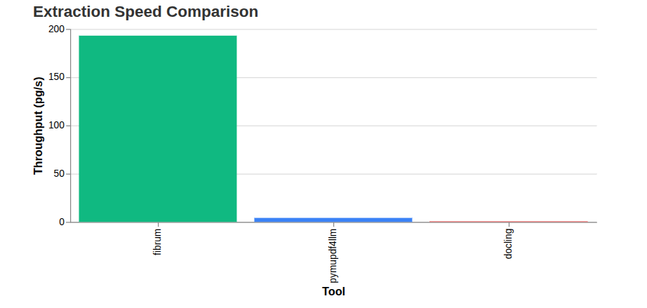
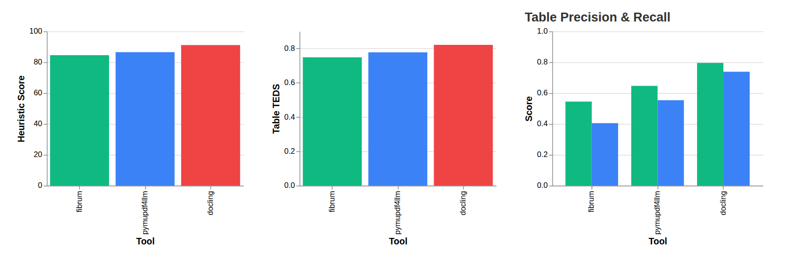
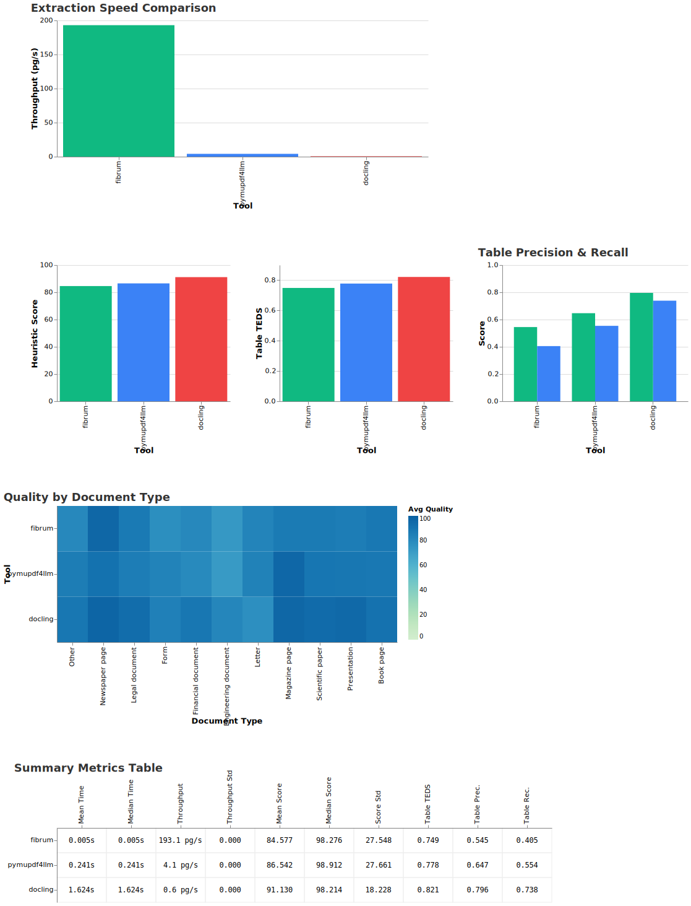

# FibrumPDF

Extract 200+ pages per second on CPU.

Gives you tables, text, and their formatting, plus lower level information like bounding boxes and font sizes.

It outputs JSON for programmatic use, but still allows for Markdown.

Written for Python, Go at the core, with a touch of C to interface with MuPDF.

- ~50×+ faster than pymupdf4llm and docling
- Moderate drop in table precision/recall
- Comparable structural extraction quality (TEDS)



**Full benchmark information** [here](#Benchmark-information)

---

# Installation

```bash
pip install fibrum-pdf
```

> There are wheels for Python 3.9–3.14 (inclusive of minor versions) on macOS (ARM/x64) and all modern Linux distributions.

**To build from source**, see [BUILD.md](BUILD.md). 

---

## What it's good at

- Speed.
- Custom logic.
- No GPU needed.
- Iterating on parsing logic without waiting hours.

## What it's bad at

- Scanned PDFs and images. It doesn't extract images, nor parse them
- Complex layouts (think Forms, spreadsheet-style documents)
- Lower precision and recall for tables compared to ML-based extractors
- doesn't extract code blocks and it's (very) slightly behind on formatting

---
# Usage

### Basic

```python
from fibrum_pdf import to_json

result = to_json("example.pdf", output="example.json")
print(f"Extracted to: {result.path}")
```

> You can omit the `output` field; it defaults to `<file>.json`

### Collect all pages in memory

```python
result = to_json("report.pdf", output="report.json")
pages = result.collect()

# Access pages as objects with markdown conversion
for page in pages:
    print(page.markdown)
    
# Access individual blocks
for block in pages[0]:
    print(f"Block type: {block.type}")
    print(f"Has {len(block.spans)} spans")
```

> This still saves it to `result.path`; it just allows you to load it into memory. If you don't want to write to disk at all, consider providing a special path.

> This is only for smaller PDFs. For larger ones, this may result in crashes due to loading everything into RAM. See below for a solution.

### stream pages (memory-efficient)

```python
result = to_json("large.pdf", output="large.json")

# Iterate one page at a time without loading everything
for page in result:
    for block in page:
        print(f"Block type: {block.type}")
```

### Markdown

```python
result = to_json("document.pdf", output="document.json")
pages = result.collect()

# Full document as markdown
full_markdown = pages.markdown

# Single page as markdown
page_markdown = pages[0].markdown

# Single block as markdown
block_markdown = pages[0][0].markdown
```

### Command-line

```bash
python -m fibrum_pdf.main input.pdf [output_dir]
```

---

## Output structure

Each page is a JSON array of blocks. Every block has:

- `type`: block type (text, heading, paragraph, list, table, code)
- `bbox`: [x0, y0, x1, y1] bounding box coordinates
- `font_size`: font size in points (average for multi-span blocks)
- `length`: character count
- `spans`: array of styled text spans with style flags (bold, italic, mono-space, etc.)

> Note that a span represents a logical group of styling. You'll find that most blocks only have one span.

### Span fields
- `text`: span content
- `font_size`: size in points
- `bold`, `italic`, `monospace`, `strikeout`, `superscript`, `subscript`: boolean style flags
- `link`: boolean indicating if span contains a hyperlink
- `uri`: URI string if linked, otherwise false

See [models.py](fibrum_pdf/models.py).

---

# FAQ

**why not XXX?**
There are tools that are much better in quality. These are typically reliant on some sort of ML or OCR, making them slow and GPU-dependent. There are also tools that are extremely fast, but only give you raw text; which isn't helpful. Hopefully, this is fast and good enough.

**Will this handle my XXX PDF?**  
It won't handle scanned documents, images or weird layouts and elements (think Forms in PDFs and spreadsheet-like documents).

**Commercial use?**  
This project uses MuPDF, which is under the AGPL-v3 license, or optionally a paid license from Artifex Software.

**Motivations?**
I got bored waiting for my documents to get chunked again.


---
# Benchmark information

The `datalab-to/marker-dataset` from Hugging Face is used. 
Results are generated by `benchmark/`.

**Test system:** AMD Ryzen 7 4800H (16 cores), GTX 1650 TI (for Docling)

You can review all the code and run it yourself via the Typer CLI, or also review the `benchmark/results/` directory.



---

# Optimization (how is it fast?)
Most of the performance benefits are thanks to others' hard work :)

- MuPDF is written in pure C, has many performance micro-optimizations, and is extremely high quality. This does all the hard PDF work, and so, this is a major reason.

- Compared to `Docling` and `pymupdf4llm`, Fibrum avoids ML/AI and instead uses heuristics. This trades some accuracy for significantly better performance.

- Go and C are compiled, and since the logic is CPU heavy, the difference compared to Python, for example, is major here.

- MuPDF cannot be safely multithreaded with shared state, so parallelism is achieved with `fork`. Each process has its own memory space, allowing near-linear scaling with core count.

- The parallelism is aggressive. We intentionally oversubscribe on goroutines to allow the CPU to be fully saturated, for example, when the CPU pauses for the GC or RAM, a goroutine is always available to take it's place for a bit if we use 2-3x more.

- Instead of relying on CGO/FFI, intermediate data is written as raw buffers and read by Go using zero-copy-style views. This avoids repeated boundary crossings and large memory copies. The workload is CPU-bound, so disk I/O (largely handled by the OS page cache) is not the bottleneck.


# Licensing
This project uses MuPDF, which is under the AGPL-v3 license, or optionally a paid license from Artifex Software.

See [LICENSE](LICENSE) for the detail.

