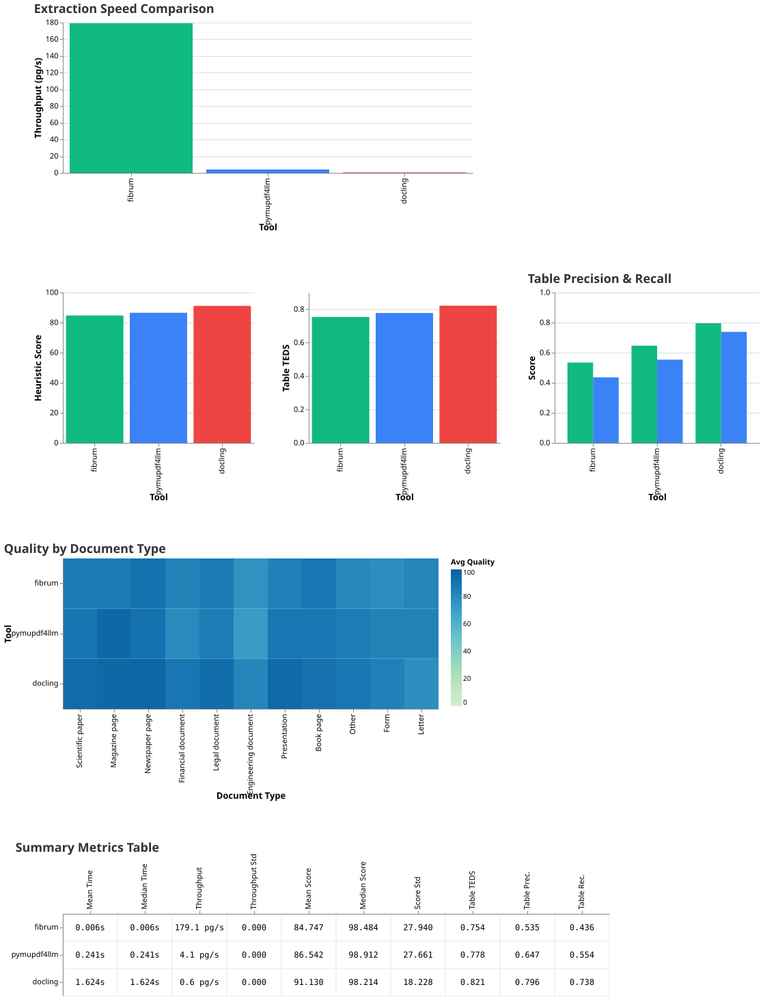

# FibrumPDF

**Structured PDF extraction at 318 pages per second on CPU.**

[](https://pypi.org/project/fibrum-pdf/)
[](https://github.com/intercepted16/fibrumpdf/actions/workflows/ci.yml)
[](LICENSE)

FibrumPDF turns digital PDFs into structured JSON or clean Markdown without a
GPU, a model download, or a remote API. It preserves headings, paragraphs,
lists, tables, reading order, bounding boxes, links, and inline formatting while
keeping extraction native and parallel.

The native pipeline targets workloads that need structure without spending
seconds on every page.



## Performance, measured

The repository benchmark contains 512 documents from the
`datalab-to/marker_benchmark` dataset. On the documented Ryzen 7 4800H test
system, the current FibrumPDF build processes **318.2 pages/s**, about **77x**
PyMuPDF4LLM and **517x** Docling in this benchmark.

| Extractor | Pages/s | Text score | Table TEDS | Table precision | Table recall |
| --- | ---: | ---: | ---: | ---: | ---: |
| **FibrumPDF** | **318.23** | **87.31** | **0.783** | **0.661** | **0.590** |
| PyMuPDF4LLM | 4.15 | 86.54 | 0.778 | 0.647 | 0.554 |
| Docling | 0.62 | 91.13 | 0.821 | 0.796 | 0.738 |

PyMuPDF4LLM is the closest speed comparison. Docling scores higher on difficult
tables and irregular layouts, but takes substantially longer.

[Open the interactive report](benchmark/results/dashboard.html) or see
[how the benchmark works](#reproduce-the-benchmark).

## Features

- Semantic blocks: headings, paragraphs, lists, code, figures, and tables.
- Layout metadata: page numbers and block, row, cell, and span bounding boxes.
- Inline formatting: bold, italic, monospace, strikeout, super/subscript, links.
- Two consumption modes: collect small documents or stream large ones page by
  page with bounded memory.
- Atomic output: failed extraction never leaves a half-written destination.
- Native wheels for Python 3.11+ on Linux x86_64, macOS arm64, and Windows x64.

## Quick start

```bash
uv pip install fibrum-pdf
```

Extract JSON:

```python
from fibrum_pdf import to_json

result = to_json("report.pdf", "report.json")
print(result.path)

for page in result:  # streamed; the whole document is not loaded
    print(page.markdown)
```

Write Markdown directly. Pages are converted incrementally and the destination
is replaced atomically:

```python
from fibrum_pdf import to_markdown

path = to_markdown("report.pdf", "report.md")
```

For smaller documents, collect typed Pydantic-backed objects:

```python
pages = to_json("report.pdf").collect()

print(pages[0].markdown)
print(pages[0][0].type, pages[0][0].bbox)
```

The CLI exposes both formats:

```bash
uv run fibrum-pdf report.pdf report.json
uv run fibrum-pdf report.pdf report.md --format markdown
```

The output path is optional; it defaults to the PDF name with a `.json` or `.md`
suffix.

## Output model

The JSON document is an array of pages. Each page contains a `data` array of
blocks:

```json
[
  {
    "page": 1,
    "data": [
      {
        "type": "heading",
        "level": 1,
        "bbox": [178.64, 84.50, 433.36, 102.55],
        "font_size": 24,
        "spans": [
          {"text": "Quarterly report", "font_size": 0, "bold": true}
        ]
      }
    ]
  }
]
```

Tables add row and cell geometry; lists add typed items, markers, and indentation.
See [the public models](fibrum_pdf/models.py) for the complete schema.

## How it works

MuPDF handles PDF interpretation. Go performs layout analysis, table detection,
classification, cleanup, and bounded parallel page processing. Python stays a
thin orchestration layer and exposes the native result lazily through `ijson`.

Text and vector edges are captured in one page pass. Ruled tables use line
grids. Borderless tables are built from contiguous multi-column rows, with
structural checks to reject prose columns, diagrams, and fragmented labels.

MuPDF access is serialized where required. Page processing uses bounded workers,
so memory use depends on active pages rather than document length.

## Known limits

FibrumPDF does not run OCR or extract embedded images. Scanned PDFs require
another tool. Forms, spreadsheets, heavily layered pages, and unconventional
visual layouts can also defeat the heuristic extractor.

Use the benchmark as a starting point, then test representative documents from
your own workload before committing to an extraction stack.

## Reproduce the benchmark

Benchmark reports are generated by the code in [`benchmark/`](benchmark/). The
committed comparison uses 512 deterministic samples (`--seed 0`, one timing run)
on an AMD Ryzen 7 4800H; Docling used the machine's GTX 1650 Ti where applicable.

```bash
uv sync --extra benchmark
uv run python -m benchmark download \
  --output benchmark/data --max-rows 512
uv run python -m benchmark run \
  --dataset-path benchmark/data \
  --output benchmark/results \
  --max-rows 512 --runs 1
```

Per-document measurements, aggregate rows, and generated reports are committed
under [`benchmark/results/`](benchmark/results/). Throughput varies by hardware;
the quality scores are the more portable comparison.

## Development

Source builds require MuPDF 1.27. See [BUILD.md](BUILD.md) for platform setup.
Once the native dependency is available:

```bash
uv sync --extra dev
uv run ruff check .
uv run ruff format --check .
uv run pytest -q

cd go
go test ./...
go vet ./...
```

## License

FibrumPDF is licensed under [AGPL-3.0](LICENSE). MuPDF is also AGPL-licensed and
is available under a commercial license from Artifex.
