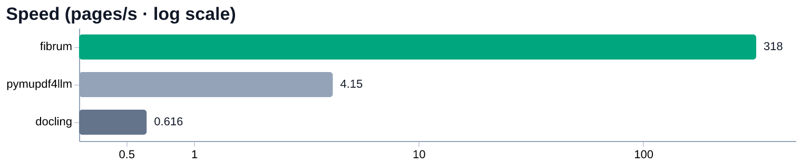
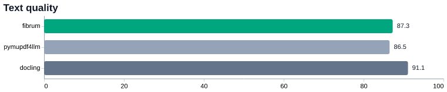
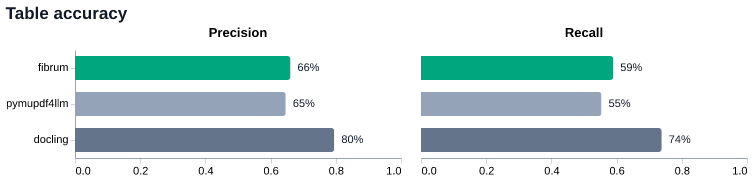
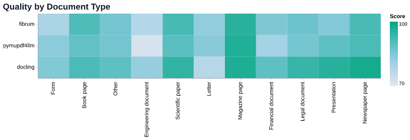

# FibrumPDF

**Structured PDF extraction at 318 pages/second on CPU.**



FibrumPDF extracts PDFs into structured JSON or Markdown, preserving things like headings, lists, tables, reading order, links, formatting and layout information.

The idea is pretty simple: there are very fast PDF extractors that mostly give you text, and much heavier document parsers that give you great structure but can take seconds per page.

FibrumPDF sits somewhere in the middle.

It uses MuPDF for the low-level PDF work and a set of layout heuristics to reconstruct the document written in Go. There's no OCR, GPU or model inference.

[Benchmark details](#benchmark) · [Build from source](BUILD.md)

## Benchmark

| Extractor     |    Pages/s | Text score | Table TEDS | Table precision | Table recall |
| ------------- | ---------: | ---------: | ---------: | --------------: | -----------: |
| **FibrumPDF** | **318.23** |  **87.31** |  **0.783** |       **0.661** |    **0.590** |
| PyMuPDF4LLM   |       4.15 |      86.54 |      0.778 |           0.647 |        0.554 |
| Docling       |       0.62 |      91.13 |      0.821 |           0.796 |        0.738 |

**Test system:** AMD Ryzen 7 4800H, with a GTX 1650 Ti available to Docling.

Throughput depends heavily on hardware, so the exact pages/second isn't particularly portable. The benchmark is mainly useful for comparing the speed/quality tradeoff between the extractors on the same machine and dataset.

## Tradeoffs

FibrumPDF is **not** trying to beat ML-based document parsers on every document.

It works best on digital PDFs where text and layout information are already present.

It does not currently:

* run OCR
* extract embedded images
* handle every form or spreadsheet-style document
* match ML-based parsers on particularly difficult layouts and tables

That's the tradeoff behind the performance.

If you have scanned documents or need the highest possible extraction quality regardless of compute, something like Docling will probably be a better fit.

If you only need raw text, a simpler extractor will probably be faster.

FibrumPDF is for when you want the structure too.

## Install

```bash
pip install fibrum-pdf
```

## Usage

```python
from fibrum_pdf import to_json

result = to_json("report.pdf", "report.json")

for page in result:
    print(page.markdown)
```

Pages are streamed instead of loading the entire document into memory.

For smaller PDFs, you can collect everything:

```python
pages = to_json("report.pdf").collect()

print(pages[0].markdown)
print(pages[0][0].type)
print(pages[0][0].bbox)
```

Or go straight to Markdown:

```python
from fibrum_pdf import to_markdown

to_markdown("report.pdf", "report.md")
```

The output path is optional and defaults to the input filename with the appropriate extension.

## What does it extract?

FibrumPDF keeps more than the text.

* headings and paragraphs
* ordered and unordered lists
* tables, including borderless tables
* reading order
* bold, italic, monospace, strikeout and super/subscript
* links
* block and span bounding boxes
* font sizes
* table row and cell geometry

The result can be used directly as Markdown, or kept as structured data when you need the underlying layout information.

```json
{
  "page": 1,
  "data": [
    {
      "type": "heading",
      "level": 1,
      "bbox": [178.64, 84.50, 433.36, 102.55],
      "font_size": 24,
      "spans": [
        {
          "text": "Quarterly report",
          "bold": true
        }
      ]
    }
  ]
}
```

See [`fibrum_pdf/models.py`](fibrum_pdf/models.py) for the full output model.

## How is it fast?

Most of the heavy work stays outside Python.

```text
PDF
 ↓
MuPDF
 ↓
text + geometry + fonts + lines
 ↓
Go
 ↓
layout + tables + structure
 ↓
Python
```

MuPDF handles PDF interpretation in C. FibrumPDF then does reading order, text grouping, classification, table detection and most other processing in Go.

It also avoids model inference entirely. Headings, tables and other structure are reconstructed from the information already inside the PDF using layout heuristics.

Pages are processed concurrently with bounded workers, and page data is extracted once and reused by later stages instead of repeatedly crossing between languages or querying the PDF again.

There isn't really one trick responsible for the speed. It's mostly keeping the hot path compiled, doing less work, and avoiding expensive work in the first place.

## CLI

```bash
fibrum-pdf report.pdf report.json
fibrum-pdf report.pdf report.md --format markdown
```

## Full benchmark details

The committed benchmark uses 512 deterministic samples from `datalab-to/marker_benchmark`.

### Charts







All generated reports are in [`benchmark/results/`](benchmark/results/). Regenerate the charts from an existing `benchmark.csv` with:

```bash
uv run python -m benchmark run --graph-only
```

To reproduce it:

```bash
uv sync --extra benchmark

uv run python -m benchmark download \
  --output benchmark/data \
  --max-rows 512

uv run python -m benchmark run \
  --dataset-path benchmark/data \
  --output benchmark/results \
  --max-rows 512 \
  --seed 0 \
  --runs 1
```

## Building from source

See [BUILD.md](BUILD.md).

Source builds currently require MuPDF 1.27.

## License

FibrumPDF is licensed under [AGPL-3.0](LICENSE).

MuPDF is also AGPL-licensed and is available under a commercial license from Artifex.
